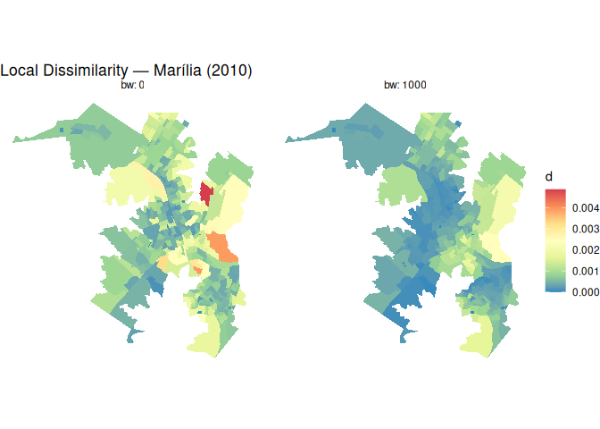

<!-- README.md is generated from README.Rmd. Please edit that file -->

# segregr

<!-- badges: start -->

[](https://github.com/mvpsaraiva/segregr/actions/workflows/R-CMD-check.yaml)
[](https://CRAN.R-project.org/package=segregr)
[](https://app.codecov.io/gh/mvpsaraiva/segregr)
[](https://github.com/mvpsaraiva/segregr/actions/workflows/pkgdown.yaml)
[](https://lifecycle.r-lib.org/articles/stages.html#experimental)
[](https://opensource.org/licenses/MIT)
<!-- badges: end -->

**segregr** calculates spatial and aspatial segregation metrics for
areal data (e.g. census tracts). It implements generalised spatial
versions of the Dissimilarity index, Theil’s Entropy and Information
Theory index (H), and the Exposure and Isolation indices. Both global
(city-wide scalar) and local (per areal unit) variants are available.
Spatial smoothing is controlled by a bandwidth parameter using Gaussian
or step kernels.

| Index                  | Global | Local |
|------------------------|--------|-------|
| Dissimilarity          | `D`    | `d`   |
| Entropy                | `E`    | —     |
| Information Theory (H) | `H`    | `h`   |
| Isolation              | `Q`    | `q`   |
| Exposure               | `P`    | `p`   |

## Installation

Install the development version from GitHub:

``` r
# install.packages("devtools")
devtools::install_github("mvpsaraiva/segregr")
```

## Usage

### Load data

`measure_segregation()` expects an `sf` object with one row per areal
unit, an `id` column, a `geometry` column, and one column per population
group containing that group’s count in each unit.

``` r
library(sf)
library(segregr)

marilia_sf <- st_read(
  system.file("extdata/marilia_2010.gpkg", package = "segregr"),
  quiet = TRUE
)
head(marilia_sf)
#> Simple feature collection with 6 features and 10 fields
#> Geometry type: POLYGON
#> Dimension:     XY
#> Bounding box:  xmin: 607157.7 ymin: 7542394 xmax: 608397 ymax: 7543216
#> Projected CRS: SIRGAS 2000 / UTM zone 22S
#>                id mw_0_to_05 mw_05_to_1 mw_1_to_2 mw_2_to_3 mw_3_to_5
#> 1 352900505000001          3         20        28        13        28
#> 2 352900505000002          0          6        10        12        17
#> 3 352900505000003          0          8        21        25        58
#> 4 352900505000004          3         17        23        16        36
#> 5 352900505000005          2         45        63        43        39
#> 6 352900505000006          3         72        99        47        34
#>   mw_5_to_10 mw_10_to_15 mw_15_to_20 mw_20_above                           geom
#> 1         21           1           2           5 POLYGON ((608174.8 7542852,...
#> 2         37          11           9           7 POLYGON ((608355.9 7542806,...
#> 3         43          12          10          12 POLYGON ((608020.1 7542689,...
#> 4         43           8          15          10 POLYGON ((608089.5 7542497,...
#> 5         21           2           5           3 POLYGON ((607678.5 7542456,...
#> 6         22           2           3           0 POLYGON ((607427.8 7543110,...
```

### Classical (aspatial) metrics

Pass the sf object to `measure_segregation()`. The default
`bandwidths = 0` returns classical, non-spatial indices.

``` r
seg <- measure_segregation(marilia_sf)
```

Global indices are returned as data frames with one row per bandwidth:

``` r
seg$D   # Dissimilarity
#>       bw         D
#>    <num>     <num>
#> 1:     0 0.2749453
seg$H   # Information Theory index
#>       bw        H
#>    <num>    <num>
#> 1:     0 0.110396
seg$E   # Entropy (scalar)
#> [1] 1.733732
```

The Exposure/Isolation matrix shows how much each group is exposed to
every other group (off-diagonal) and to itself (diagonal = Isolation):

``` r
exposure_isolation_matrix(seg)
#> # A tibble: 9 × 10
#>   group       mw_0_to_05 mw_05_to_1 mw_1_to_2 mw_2_to_3 mw_3_to_5 mw_5_to_10
#>   <fct>            <dbl>      <dbl>     <dbl>     <dbl>     <dbl>      <dbl>
#> 1 mw_0_to_05     0.0552      0.264      0.398     0.140    0.0886     0.0425
#> 2 mw_05_to_1     0.0259      0.236      0.385     0.160    0.112      0.0619
#> 3 mw_1_to_2      0.0208      0.205      0.400     0.170    0.119      0.0651
#> 4 mw_2_to_3      0.0151      0.177      0.354     0.183    0.144      0.0936
#> 5 mw_3_to_5      0.0116      0.149      0.298     0.174    0.173      0.134 
#> 6 mw_5_to_10     0.00784     0.117      0.231     0.159    0.189      0.194 
#> 7 mw_10_to_15    0.00564     0.0912     0.174     0.141    0.200      0.232 
#> 8 mw_15_to_20    0.00470     0.0806     0.157     0.126    0.192      0.246 
#> 9 mw_20_above    0.00470     0.0785     0.154     0.126    0.194      0.241 
#> # ℹ 3 more variables: mw_10_to_15 <dbl>, mw_15_to_20 <dbl>, mw_20_above <dbl>
```

Collect all global metrics in one data frame for easy export or
comparison:

``` r
global_metrics_to_df(seg)
#> Joining with `by = join_by(bw)`
#>       bw dissimilarity  entropy        h iso_mw_05_to_1_mw_05_to_1
#>    <num>         <num>    <num>    <num>                     <num>
#> 1:     0     0.2749453 1.733732 0.110396                 0.2364882
#>    exp_mw_05_to_1_mw_0_to_05 exp_mw_05_to_1_mw_10_to_15
#>                        <num>                      <num>
#> 1:                0.02587234                0.008798747
#>    exp_mw_05_to_1_mw_15_to_20 exp_mw_05_to_1_mw_1_to_2
#>                         <num>                    <num>
#> 1:                0.006238731                  0.38501
#>    exp_mw_05_to_1_mw_20_above exp_mw_05_to_1_mw_2_to_3 exp_mw_05_to_1_mw_3_to_5
#>                         <num>                    <num>                    <num>
#> 1:                0.004206512                 0.159624                0.1119009
#>    exp_mw_05_to_1_mw_5_to_10 exp_mw_0_to_05_mw_05_to_1
#>                        <num>                     <num>
#> 1:                0.06186045                 0.2640587
#>    iso_mw_0_to_05_mw_0_to_05 exp_mw_0_to_05_mw_10_to_15
#>                        <num>                      <num>
#> 1:                0.05521598                0.005555959
#>    exp_mw_0_to_05_mw_15_to_20 exp_mw_0_to_05_mw_1_to_2
#>                         <num>                    <num>
#> 1:                0.003711193                0.3981764
#>    exp_mw_0_to_05_mw_20_above exp_mw_0_to_05_mw_2_to_3 exp_mw_0_to_05_mw_3_to_5
#>                         <num>                    <num>                    <num>
#> 1:                0.002569778                0.1396162               0.08864015
#>    exp_mw_0_to_05_mw_5_to_10 exp_mw_10_to_15_mw_05_to_1
#>                        <num>                      <num>
#> 1:                0.04245557                 0.09117555
#>    exp_mw_10_to_15_mw_0_to_05 iso_mw_10_to_15_mw_10_to_15
#>                         <num>                       <num>
#> 1:                0.005640945                  0.06411305
#>    exp_mw_10_to_15_mw_15_to_20 exp_mw_10_to_15_mw_1_to_2
#>                          <num>                     <num>
#> 1:                  0.05391762                 0.1741498
#>    exp_mw_10_to_15_mw_20_above exp_mw_10_to_15_mw_2_to_3
#>                          <num>                     <num>
#> 1:                     0.03855                 0.1411967
#>    exp_mw_10_to_15_mw_3_to_5 exp_mw_10_to_15_mw_5_to_10
#>                        <num>                      <num>
#> 1:                  0.199749                  0.2315073
#>    exp_mw_15_to_20_mw_05_to_1 exp_mw_15_to_20_mw_0_to_05
#>                         <num>                      <num>
#> 1:                 0.08059787                0.004697601
#>    exp_mw_15_to_20_mw_10_to_15 iso_mw_15_to_20_mw_15_to_20
#>                          <num>                       <num>
#> 1:                   0.0672203                  0.07704059
#>    exp_mw_15_to_20_mw_1_to_2 exp_mw_15_to_20_mw_20_above
#>                        <num>                       <num>
#> 1:                 0.1566841                  0.05016094
#>    exp_mw_15_to_20_mw_2_to_3 exp_mw_15_to_20_mw_3_to_5
#>                        <num>                     <num>
#> 1:                 0.1257555                 0.1918903
#>    exp_mw_15_to_20_mw_5_to_10 exp_mw_1_to_2_mw_05_to_1 exp_mw_1_to_2_mw_0_to_05
#>                         <num>                    <num>                    <num>
#> 1:                  0.2459528                 0.204846               0.02075709
#>    exp_mw_1_to_2_mw_10_to_15 exp_mw_1_to_2_mw_15_to_20 iso_mw_1_to_2_mw_1_to_2
#>                        <num>                     <num>                   <num>
#> 1:               0.008941718               0.006452875               0.3999796
#>    exp_mw_1_to_2_mw_20_above exp_mw_1_to_2_mw_2_to_3 exp_mw_1_to_2_mw_3_to_5
#>                        <num>                   <num>                   <num>
#> 1:               0.004379483               0.1704538               0.1190404
#>    exp_mw_1_to_2_mw_5_to_10 exp_mw_20_above_mw_05_to_1
#>                       <num>                      <num>
#> 1:               0.06514896                 0.07847571
#>    exp_mw_20_above_mw_0_to_05 exp_mw_20_above_mw_10_to_15
#>                         <num>                       <num>
#> 1:                0.004697254                  0.06940326
#>    exp_mw_20_above_mw_15_to_20 exp_mw_20_above_mw_1_to_2
#>                          <num>                     <num>
#> 1:                   0.0724355                 0.1535608
#>    iso_mw_20_above_mw_20_above exp_mw_20_above_mw_2_to_3
#>                          <num>                     <num>
#> 1:                  0.06049175                 0.1257347
#>    exp_mw_20_above_mw_3_to_5 exp_mw_20_above_mw_5_to_10
#>                        <num>                      <num>
#> 1:                 0.1938629                  0.2413381
#>    exp_mw_2_to_3_mw_05_to_1 exp_mw_2_to_3_mw_0_to_05 exp_mw_2_to_3_mw_10_to_15
#>                       <num>                    <num>                     <num>
#> 1:                0.1765474               0.01512984                0.01507059
#>    exp_mw_2_to_3_mw_15_to_20 exp_mw_2_to_3_mw_1_to_2 exp_mw_2_to_3_mw_20_above
#>                        <num>                   <num>                     <num>
#> 1:                0.01076621               0.3543352               0.007454269
#>    iso_mw_2_to_3_mw_2_to_3 exp_mw_2_to_3_mw_3_to_5 exp_mw_2_to_3_mw_5_to_10
#>                      <num>                   <num>                    <num>
#> 1:               0.1830283               0.1440565               0.09361164
#>    exp_mw_3_to_5_mw_05_to_1 exp_mw_3_to_5_mw_0_to_05 exp_mw_3_to_5_mw_10_to_15
#>                       <num>                    <num>                     <num>
#> 1:                0.1492793               0.01158595                0.02571538
#>    exp_mw_3_to_5_mw_15_to_20 exp_mw_3_to_5_mw_1_to_2 exp_mw_3_to_5_mw_20_above
#>                        <num>                   <num>                     <num>
#> 1:                0.01981489               0.2984728                0.01386269
#>    exp_mw_3_to_5_mw_2_to_3 iso_mw_3_to_5_mw_3_to_5 exp_mw_3_to_5_mw_5_to_10
#>                      <num>                   <num>                    <num>
#> 1:               0.1737543               0.1733743                0.1341404
#>    exp_mw_5_to_10_mw_05_to_1 exp_mw_5_to_10_mw_0_to_05
#>                        <num>                     <num>
#> 1:                 0.1165286               0.007835908
#>    exp_mw_5_to_10_mw_10_to_15 exp_mw_5_to_10_mw_15_to_20
#>                         <num>                      <num>
#> 1:                 0.04208493                 0.03586277
#>    exp_mw_5_to_10_mw_1_to_2 exp_mw_5_to_10_mw_20_above exp_mw_5_to_10_mw_2_to_3
#>                       <num>                      <num>                    <num>
#> 1:                0.2306595                 0.02436869                0.1594359
#>    exp_mw_5_to_10_mw_3_to_5 iso_mw_5_to_10_mw_5_to_10
#>                       <num>                     <num>
#> 1:                0.1894144                 0.1938094
```

### Local metrics

Local indices return one value per areal unit. Helper functions join
them back to the input geometries for mapping:

``` r
d_sf <- dissimilarity_to_sf(seg)
head(d_sf[, c("id", "bw", "dissimilarity")])
#> Simple feature collection with 6 features and 3 fields
#> Geometry type: POLYGON
#> Dimension:     XY
#> Bounding box:  xmin: 607157.7 ymin: 7542394 xmax: 608397 ymax: 7543216
#> Projected CRS: SIRGAS 2000 / UTM zone 22S
#>                id bw dissimilarity                           geom
#> 1 352900505000001  0  0.0005470273 POLYGON ((608174.8 7542852,...
#> 2 352900505000002  0  0.0011001293 POLYGON ((608355.9 7542806,...
#> 3 352900505000003  0  0.0017888527 POLYGON ((608020.1 7542689,...
#> 4 352900505000004  0  0.0013975371 POLYGON ((608089.5 7542497,...
#> 5 352900505000005  0  0.0004308401 POLYGON ((607678.5 7542456,...
#> 6 352900505000006  0  0.0004429882 POLYGON ((607427.8 7543110,...
```

`local_metrics_to_sf()` combines all local metrics into a single wide sf
object:

``` r
local_sf <- local_metrics_to_sf(seg)
#> Joining with `by = join_by(id, bw)`
names(local_sf)
#>  [1] "id"                          "bw"                         
#>  [3] "dissimilarity"               "entropy"                    
#>  [5] "h"                           "iso_mw_05_to_1_mw_05_to_1"  
#>  [7] "exp_mw_05_to_1_mw_0_to_05"   "exp_mw_05_to_1_mw_10_to_15" 
#>  [9] "exp_mw_05_to_1_mw_15_to_20"  "exp_mw_05_to_1_mw_1_to_2"   
#> [11] "exp_mw_05_to_1_mw_20_above"  "exp_mw_05_to_1_mw_2_to_3"   
#> [13] "exp_mw_05_to_1_mw_3_to_5"    "exp_mw_05_to_1_mw_5_to_10"  
#> [15] "exp_mw_0_to_05_mw_05_to_1"   "iso_mw_0_to_05_mw_0_to_05"  
#> [17] "exp_mw_0_to_05_mw_10_to_15"  "exp_mw_0_to_05_mw_15_to_20" 
#> [19] "exp_mw_0_to_05_mw_1_to_2"    "exp_mw_0_to_05_mw_20_above" 
#> [21] "exp_mw_0_to_05_mw_2_to_3"    "exp_mw_0_to_05_mw_3_to_5"   
#> [23] "exp_mw_0_to_05_mw_5_to_10"   "exp_mw_10_to_15_mw_05_to_1" 
#> [25] "exp_mw_10_to_15_mw_0_to_05"  "iso_mw_10_to_15_mw_10_to_15"
#> [27] "exp_mw_10_to_15_mw_15_to_20" "exp_mw_10_to_15_mw_1_to_2"  
#> [29] "exp_mw_10_to_15_mw_20_above" "exp_mw_10_to_15_mw_2_to_3"  
#> [31] "exp_mw_10_to_15_mw_3_to_5"   "exp_mw_10_to_15_mw_5_to_10" 
#> [33] "exp_mw_15_to_20_mw_05_to_1"  "exp_mw_15_to_20_mw_0_to_05" 
#> [35] "exp_mw_15_to_20_mw_10_to_15" "iso_mw_15_to_20_mw_15_to_20"
#> [37] "exp_mw_15_to_20_mw_1_to_2"   "exp_mw_15_to_20_mw_20_above"
#> [39] "exp_mw_15_to_20_mw_2_to_3"   "exp_mw_15_to_20_mw_3_to_5"  
#> [41] "exp_mw_15_to_20_mw_5_to_10"  "exp_mw_1_to_2_mw_05_to_1"   
#> [43] "exp_mw_1_to_2_mw_0_to_05"    "exp_mw_1_to_2_mw_10_to_15"  
#> [45] "exp_mw_1_to_2_mw_15_to_20"   "iso_mw_1_to_2_mw_1_to_2"    
#> [47] "exp_mw_1_to_2_mw_20_above"   "exp_mw_1_to_2_mw_2_to_3"    
#> [49] "exp_mw_1_to_2_mw_3_to_5"     "exp_mw_1_to_2_mw_5_to_10"   
#> [51] "exp_mw_20_above_mw_05_to_1"  "exp_mw_20_above_mw_0_to_05" 
#> [53] "exp_mw_20_above_mw_10_to_15" "exp_mw_20_above_mw_15_to_20"
#> [55] "exp_mw_20_above_mw_1_to_2"   "iso_mw_20_above_mw_20_above"
#> [57] "exp_mw_20_above_mw_2_to_3"   "exp_mw_20_above_mw_3_to_5"  
#> [59] "exp_mw_20_above_mw_5_to_10"  "exp_mw_2_to_3_mw_05_to_1"   
#> [61] "exp_mw_2_to_3_mw_0_to_05"    "exp_mw_2_to_3_mw_10_to_15"  
#> [63] "exp_mw_2_to_3_mw_15_to_20"   "exp_mw_2_to_3_mw_1_to_2"    
#> [65] "exp_mw_2_to_3_mw_20_above"   "iso_mw_2_to_3_mw_2_to_3"    
#> [67] "exp_mw_2_to_3_mw_3_to_5"     "exp_mw_2_to_3_mw_5_to_10"   
#> [69] "exp_mw_3_to_5_mw_05_to_1"    "exp_mw_3_to_5_mw_0_to_05"   
#> [71] "exp_mw_3_to_5_mw_10_to_15"   "exp_mw_3_to_5_mw_15_to_20"  
#> [73] "exp_mw_3_to_5_mw_1_to_2"     "exp_mw_3_to_5_mw_20_above"  
#> [75] "exp_mw_3_to_5_mw_2_to_3"     "iso_mw_3_to_5_mw_3_to_5"    
#> [77] "exp_mw_3_to_5_mw_5_to_10"    "exp_mw_5_to_10_mw_05_to_1"  
#> [79] "exp_mw_5_to_10_mw_0_to_05"   "exp_mw_5_to_10_mw_10_to_15" 
#> [81] "exp_mw_5_to_10_mw_15_to_20"  "exp_mw_5_to_10_mw_1_to_2"   
#> [83] "exp_mw_5_to_10_mw_20_above"  "exp_mw_5_to_10_mw_2_to_3"   
#> [85] "exp_mw_5_to_10_mw_3_to_5"    "iso_mw_5_to_10_mw_5_to_10"  
#> [87] "geom"
```

### Spatial metrics with bandwidth

Pass one or more bandwidths (in metres) to smooth population counts
across neighbouring units before computing indices:

``` r
seg_bw <- measure_segregation(marilia_sf, bandwidths = c(0, 500, 1000, 2000))
global_metrics_to_df(seg_bw)
#> Joining with `by = join_by(bw)`
#>       bw dissimilarity  entropy          h iso_mw_05_to_1_mw_05_to_1
#>    <num>         <num>    <num>      <num>                     <num>
#> 1:     0    0.27494530 1.733732 0.11039597                 0.2364882
#> 2:   500    0.19384492 1.733732 0.06187898                 0.2058831
#> 3:  1000    0.14361634 1.733732 0.03784674                 0.1992349
#> 4:  2000    0.08528704 1.733732 0.00713483                 0.1887534
#>    exp_mw_05_to_1_mw_0_to_05 exp_mw_05_to_1_mw_10_to_15
#>                        <num>                      <num>
#> 1:                0.02587234                0.008798747
#> 2:                0.02033873                0.012153184
#> 3:                0.01929088                0.014668137
#> 4:                0.01822680                0.018006443
#>    exp_mw_05_to_1_mw_15_to_20 exp_mw_05_to_1_mw_1_to_2
#>                         <num>                    <num>
#> 1:                0.006238731                0.3850100
#> 2:                0.009005735                0.3746419
#> 3:                0.011152116                0.3662909
#> 4:                0.014219236                0.3480833
#>    exp_mw_05_to_1_mw_20_above exp_mw_05_to_1_mw_2_to_3 exp_mw_05_to_1_mw_3_to_5
#>                         <num>                    <num>                    <num>
#> 1:                0.004206512                0.1596240                0.1119009
#> 2:                0.006065315                0.1688672                0.1265768
#> 3:                0.007533963                0.1709126                0.1342957
#> 4:                0.009722317                0.1681879                0.1398180
#>    exp_mw_05_to_1_mw_5_to_10 exp_mw_0_to_05_mw_05_to_1
#>                        <num>                     <num>
#> 1:                0.06186045                 0.2640587
#> 2:                0.07700370                 0.2075815
#> 3:                0.08703116                 0.1968868
#> 4:                0.09848478                 0.1860266
#>    iso_mw_0_to_05_mw_0_to_05 exp_mw_0_to_05_mw_10_to_15
#>                        <num>                      <num>
#> 1:                0.05521598                0.005555959
#> 2:                0.02310489                0.009708524
#> 3:                0.01966230                0.013196792
#> 4:                0.01811073                0.017346016
#>    exp_mw_0_to_05_mw_15_to_20 exp_mw_0_to_05_mw_1_to_2
#>                         <num>                    <num>
#> 1:                0.003711193                0.3981764
#> 2:                0.007108343                0.3795749
#> 3:                0.009958010                0.3634430
#> 4:                0.013709452                0.3429977
#>    exp_mw_0_to_05_mw_20_above exp_mw_0_to_05_mw_2_to_3 exp_mw_0_to_05_mw_3_to_5
#>                         <num>                    <num>                    <num>
#> 1:                0.002569778                0.1396162               0.08864015
#> 2:                0.004770420                0.1649465               0.11714341
#> 3:                0.006729836                0.1672026               0.12830886
#> 4:                0.009392304                0.1648150               0.13606636
#>    exp_mw_0_to_05_mw_5_to_10 exp_mw_10_to_15_mw_05_to_1
#>                        <num>                      <num>
#> 1:                0.04245557                 0.09117555
#> 2:                0.06575290                 0.12593533
#> 3:                0.08029765                 0.15199612
#> 4:                0.09511667                 0.18658876
#>    exp_mw_10_to_15_mw_0_to_05 iso_mw_10_to_15_mw_10_to_15
#>                         <num>                       <num>
#> 1:                0.005640945                  0.06411305
#> 2:                0.009857029                  0.03989020
#> 3:                0.013398655                  0.03026997
#> 4:                0.017611347                  0.02379594
#>    exp_mw_10_to_15_mw_15_to_20 exp_mw_10_to_15_mw_1_to_2
#>                          <num>                     <num>
#> 1:                  0.05391762                 0.1741498
#> 2:                  0.03523534                 0.2222401
#> 3:                  0.02583586                 0.2641170
#> 4:                  0.01932445                 0.3305869
#>    exp_mw_10_to_15_mw_20_above exp_mw_10_to_15_mw_2_to_3
#>                          <num>                     <num>
#> 1:                  0.03855000                 0.1411967
#> 2:                  0.02441988                 0.1424901
#> 3:                  0.01757145                 0.1500601
#> 4:                  0.01318152                 0.1702039
#>    exp_mw_10_to_15_mw_3_to_5 exp_mw_10_to_15_mw_5_to_10
#>                        <num>                      <num>
#> 1:                 0.1997490                  0.2315073
#> 2:                 0.1706388                  0.1725826
#> 3:                 0.1573446                  0.1414326
#> 4:                 0.1555086                  0.1211683
#>    exp_mw_15_to_20_mw_05_to_1 exp_mw_15_to_20_mw_0_to_05
#>                         <num>                      <num>
#> 1:                 0.08059787                0.004697601
#> 2:                 0.11634466                0.008997688
#> 3:                 0.14407364                0.012604776
#> 4:                 0.18369761                0.017353323
#>    exp_mw_15_to_20_mw_10_to_15 iso_mw_15_to_20_mw_15_to_20
#>                          <num>                       <num>
#> 1:                  0.06722030                  0.07704059
#> 2:                  0.04392868                  0.04274526
#> 3:                  0.03221015                  0.02804585
#> 4:                  0.02409223                  0.01967621
#>    exp_mw_15_to_20_mw_1_to_2 exp_mw_15_to_20_mw_20_above
#>                        <num>                       <num>
#> 1:                 0.1566841                  0.05016094
#> 2:                 0.2052545                  0.02986414
#> 3:                 0.2486732                  0.01916025
#> 4:                 0.3235339                  0.01343662
#>    exp_mw_15_to_20_mw_2_to_3 exp_mw_15_to_20_mw_3_to_5
#>                        <num>                     <num>
#> 1:                 0.1257555                 0.1918903
#> 2:                 0.1361210                 0.1715941
#> 3:                 0.1449334                 0.1577601
#> 4:                 0.1673688                 0.1543703
#>    exp_mw_15_to_20_mw_5_to_10 exp_mw_1_to_2_mw_05_to_1 exp_mw_1_to_2_mw_0_to_05
#>                         <num>                    <num>                    <num>
#> 1:                  0.2459528                0.2048460               0.02075709
#> 2:                  0.1838446                0.1993296               0.01978738
#> 3:                  0.1472277                0.1948865               0.01894642
#> 4:                  0.1216697                0.1851991               0.01788060
#>    exp_mw_1_to_2_mw_10_to_15 exp_mw_1_to_2_mw_15_to_20 iso_mw_1_to_2_mw_1_to_2
#>                        <num>                     <num>                   <num>
#> 1:               0.008941718               0.006452875               0.3999796
#> 2:               0.011410914               0.008453198               0.3805512
#> 3:               0.013561081               0.010241351               0.3670377
#> 4:               0.016973981               0.013324412               0.3455649
#>    exp_mw_1_to_2_mw_20_above exp_mw_1_to_2_mw_2_to_3 exp_mw_1_to_2_mw_3_to_5
#>                        <num>                   <num>                   <num>
#> 1:               0.004379483               0.1704538               0.1190404
#> 2:               0.005738629               0.1716461               0.1261401
#> 3:               0.006986948               0.1698781               0.1306038
#> 4:               0.009118434               0.1657046               0.1357919
#>    exp_mw_1_to_2_mw_5_to_10 exp_mw_20_above_mw_05_to_1
#>                       <num>                      <num>
#> 1:               0.06514896                 0.07847571
#> 2:               0.07449412                 0.11315309
#> 3:               0.08223749                 0.14055184
#> 4:               0.09407591                 0.18137728
#>    exp_mw_20_above_mw_0_to_05 exp_mw_20_above_mw_10_to_15
#>                         <num>                       <num>
#> 1:                0.004697254                  0.06940326
#> 2:                0.008719770                  0.04396420
#> 3:                0.012301353                  0.03163465
#> 4:                0.017168032                  0.02373127
#>    exp_mw_20_above_mw_15_to_20 exp_mw_20_above_mw_1_to_2
#>                          <num>                     <num>
#> 1:                  0.07243550                 0.1535608
#> 2:                  0.04312567                 0.2012175
#> 3:                  0.02766859                 0.2449881
#> 4:                  0.01940332                 0.3197259
#>    iso_mw_20_above_mw_20_above exp_mw_20_above_mw_2_to_3
#>                          <num>                     <num>
#> 1:                  0.06049175                 0.1257347
#> 2:                  0.03232022                 0.1326638
#> 3:                  0.01963918                 0.1417982
#> 4:                  0.01330022                 0.1651013
#>    exp_mw_20_above_mw_3_to_5 exp_mw_20_above_mw_5_to_10
#>                        <num>                      <num>
#> 1:                 0.1938629                  0.2413381
#> 2:                 0.1682235                  0.1786441
#> 3:                 0.1544202                  0.1429449
#> 4:                 0.1521485                  0.1198190
#>    exp_mw_2_to_3_mw_05_to_1 exp_mw_2_to_3_mw_0_to_05 exp_mw_2_to_3_mw_10_to_15
#>                       <num>                    <num>                     <num>
#> 1:                0.1765474               0.01512984                0.01507059
#> 2:                0.1867705               0.01787481                0.01520864
#> 3:                0.1890328               0.01811931                0.01601662
#> 4:                0.1860193               0.01786056                0.01816666
#>    exp_mw_2_to_3_mw_15_to_20 exp_mw_2_to_3_mw_1_to_2 exp_mw_2_to_3_mw_20_above
#>                        <num>                   <num>                     <num>
#> 1:                0.01076621               0.3543352               0.007454269
#> 2:                0.01165363               0.3568137               0.007865065
#> 3:                0.01240807               0.3531384               0.008406609
#> 4:                0.01432882               0.3444626               0.009788147
#>    iso_mw_2_to_3_mw_2_to_3 exp_mw_2_to_3_mw_3_to_5 exp_mw_2_to_3_mw_5_to_10
#>                      <num>                   <num>                    <num>
#> 1:               0.1830283               0.1440565               0.09361164
#> 2:               0.1721596               0.1378920               0.09063976
#> 3:               0.1692280               0.1368938               0.09208736
#> 4:               0.1674585               0.1400001               0.09911214
#>    exp_mw_3_to_5_mw_05_to_1 exp_mw_3_to_5_mw_0_to_05 exp_mw_3_to_5_mw_10_to_15
#>                       <num>                    <num>                     <num>
#> 1:                0.1492793               0.01158595                0.02571538
#> 2:                0.1688573               0.01531154                0.02196777
#> 3:                0.1791546               0.01677095                0.02025630
#> 4:                0.1865215               0.01778492                0.02001994
#>    exp_mw_3_to_5_mw_15_to_20 exp_mw_3_to_5_mw_1_to_2 exp_mw_3_to_5_mw_20_above
#>                        <num>                   <num>                     <num>
#> 1:                0.01981489               0.2984728                0.01386269
#> 2:                0.01771908               0.3162740                0.01202928
#> 3:                0.01629055               0.3274660                0.01104224
#> 4:                0.01594052               0.3404742                0.01087979
#>    exp_mw_3_to_5_mw_2_to_3 iso_mw_3_to_5_mw_3_to_5 exp_mw_3_to_5_mw_5_to_10
#>                      <num>                   <num>                    <num>
#> 1:               0.1737543               0.1733743                0.1341404
#> 2:               0.1663189               0.1522314                0.1161759
#> 3:               0.1651150               0.1451195                0.1079421
#> 4:               0.1688617               0.1456020                0.1066056
#>    exp_mw_5_to_10_mw_05_to_1 exp_mw_5_to_10_mw_0_to_05
#>                        <num>                     <num>
#> 1:                 0.1165286               0.007835908
#> 2:                 0.1450544               0.012135832
#> 3:                 0.1639435               0.014820317
#> 4:                 0.1855190               0.017555423
#>    exp_mw_5_to_10_mw_10_to_15 exp_mw_5_to_10_mw_15_to_20
#>                         <num>                      <num>
#> 1:                 0.04208493                 0.03586277
#> 2:                 0.03137319                 0.02680668
#> 3:                 0.02571055                 0.02146751
#> 4:                 0.02202676                 0.01774085
#>    exp_mw_5_to_10_mw_1_to_2 exp_mw_5_to_10_mw_20_above exp_mw_5_to_10_mw_2_to_3
#>                       <num>                      <num>                    <num>
#> 1:                0.2306595                 0.02436869                0.1594359
#> 2:                0.2637459                 0.01803827                0.1543743
#> 3:                0.2911613                 0.01443361                0.1568398
#> 4:                0.3330751                 0.01209852                0.1688041
#>    exp_mw_5_to_10_mw_3_to_5 iso_mw_5_to_10_mw_5_to_10
#>                       <num>                     <num>
#> 1:                0.1894144                 0.1938094
#> 2:                0.1640475                 0.1494264
#> 3:                0.1524208                 0.1273870
#> 4:                0.1505336                 0.1143621
```

Use `weight_function = "step"` for a binary (moving-window) kernel:

``` r
seg_step <- measure_segregation(marilia_sf, bandwidths = 1000,
                                weight_function = "step")
seg_step$D
#>       bw         D
#>    <num>     <num>
#> 1:  1000 0.1916467
```

### Mapping local results

``` r
if (requireNamespace("ggplot2", quietly = TRUE)) {
  d_bw <- dissimilarity_to_sf(seg_bw, bandwidths = c(0, 1000))

  ggplot2::ggplot(d_bw) +
    ggplot2::geom_sf(ggplot2::aes(fill = dissimilarity), colour = NA) +
    ggplot2::scale_fill_distiller(palette = "Spectral") +
    ggplot2::facet_wrap(~bw, labeller = ggplot2::label_both) +
    ggplot2::theme_void() +
    ggplot2::labs(title = "Local Dissimilarity — Marília (2010)", fill = "d")
}
```


